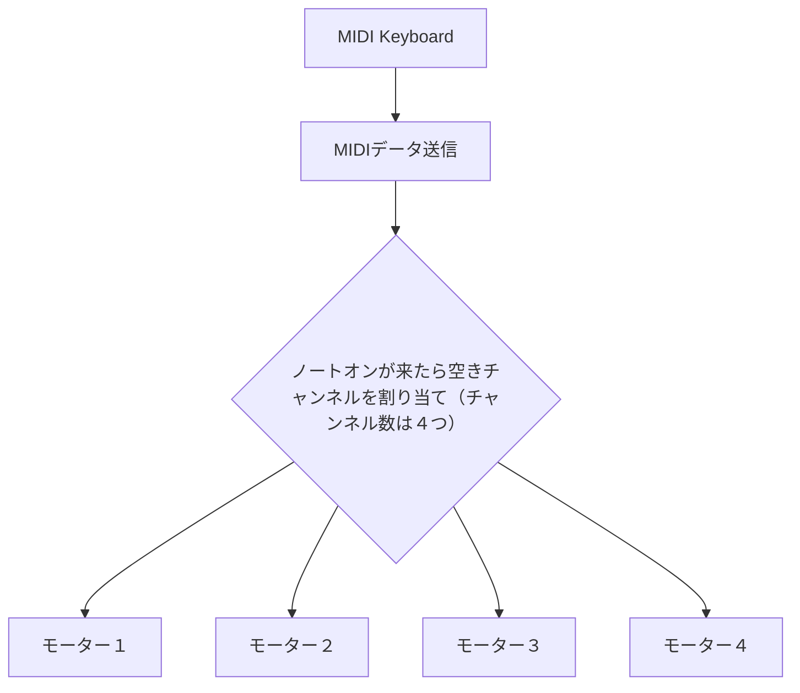

# サイエンス・フェスタ大阪２０２６
ただいま作成中です。
## 本日の構成

## ステッピングモーター
https://ja.wikipedia.org/wiki/%E3%82%B9%E3%83%86%E3%83%83%E3%83%94%E3%83%B3%E3%82%B0%E3%83%A2%E3%83%BC%E3%82%BF%E3%83%BC
## 音階
### 参考
「平均律」 https://ja.wikipedia.org/wiki/%E5%B9%B3%E5%9D%87%E5%BE%8B  
「ヴェルクマイスター音律」https://ja.wikipedia.org/wiki/%E3%83%B4%E3%82%A7%E3%83%AB%E3%82%AF%E3%83%9E%E3%82%A4%E3%82%B9%E3%82%BF%E3%83%BC%E9%9F%B3%E5%BE%8B
## MIDI参考
「MIDI規格書」 https://amei.or.jp/midistandardcommittee/MIDI1.0.pdf  
「M5STACK-U187」 フランスDREAM社のGM音源チップ「SAM2695」を搭載した、⁠M5Stack用のプログラマブルなMIDI音源ユニットです。  
「MIDI野郎」 ワンチップGM音源IC、SAM2695を使ったシンセサイザーです。  
「世界樹」 https://openmidiproject.opal.ne.jp/Sekaiju.html  MIDIシーケンサー・MIDI編集ソフト 譜面入力ができる。  
